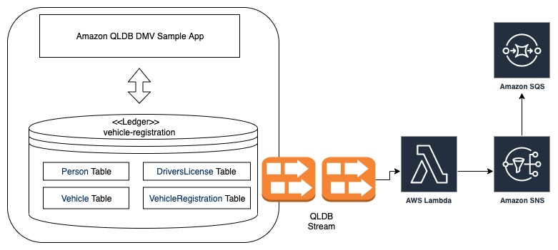

# Amazon QLDB Streams Sample Lambda in Python


The sample in this project demonstrates how to consume Amazon QLDB Streams.
It consists of an AWS Lambda function and is modeled around the [Amazon QLDB DMV Sample App](https://github.com/aws-samples/amazon-qldb-dmv-sample-python). The sample app sends out a message to an SNS Topic (which has an SQS queue subscribed to it)for new records inserted in `Person` and `VehicleRegistration` Table.



*Note: This sample can be run with any of the implementations of QLDB Sample App (Java, Python, Typescript). This sample is agnostic of the programming language in which the QLDB Sample App has been implemented because it doesn't interact directly with the QLDB DMV sample app. It simply consumes data that is streamed from your ledger. *

## Requirements

### Basic Configuration

This sample assumes that you have already setup the [Amazon QLDB SMV Sample App](https://github.com/aws-samples/amazon-qldb-dmv-sample-python). It is recommened to go through the [tutorial](https://docs.aws.amazon.com/qldb/latest/developerguide/getting-started.python.html) regarding the DMV Sample App.

In case you don't have it setup, Please refer [QLDB DMV Sample App Prequisistes](https://docs.aws.amazon.com/qldb/latest/developerguide/getting-started.python.html#getting-started.python.prereqs).

### SAM CLI

[AWS SAM](https://aws.amazon.com/serverless/sam/) provides you with a command line tool, the AWS SAM CLI, that makes it easy for you to create and manage serverless applications. You need to install and configure a few things in order to use the AWS SAM CLI. See [AWS SAM CLI Installation](https://docs.aws.amazon.com/serverless-application-model/latest/developerguide/serverless-sam-cli-install.html) for details.

### AWS CLI

SAM requires an S3 bucket to host the source code for Lambda function. We will be using the AWS CLI for creating the bucket. Please read [AWS CLI Configuration](https://docs.aws.amazon.com/cli/latest/userguide/cli-chap-configure.html#cli-quick-configuration) for help on how to configure the CLI. 

### Python 3.x

The examples require Python 3.x. Please see the link below for more detail to install Python 3.x:

* [Python 3.x Installation](https://www.python.org/downloads/)

## Deploying the Lambda Stack.

This step assumes that you already have the [Amazon QLDB DMV Sample App](https://github.com/aws-samples/amazon-qldb-dmv-sample-python) running. It is expected that `vehicle-registration` ledger and `Person`, `VehicleRegistration` tables have been created.

*Note: In case you don't have that running, please follow the [Tutorial](https://docs.aws.amazon.com/qldb/latest/developerguide/getting-started.python.html) or the [README](https://github.com/aws-samples/amazon-qldb-dmv-sample-python/blob/master/README.md) and complete the steps to create ledger and tables.*

1. We would need to create an S3 bucket. This S3 bucket would be used by SAM to host the source code of the Lambda function.

```
export BUCKET_NAME=some_unique_valid_bucket_name
aws s3 mb s3://$BUCKET_NAME
```

2. Build the Lambda source code and generate deployment artifacts that target Lambda's execution environment.

```
sam build
```

3. Package the Lambda function to S3

```
sam package \
    --output-template-file packaged.yaml \
    --s3-bucket $BUCKET_NAME
```

4. Deploy the Lambda stack

```
sam deploy \
    --template-file packaged.yaml \
    --stack-name STACK_NAME \
    --capabilities CAPABILITY_NAMED_IAM
```
*Replace `STACK_NAME` with a stack name of your choice*

6. Create QLDB Stream

- Sign in to the AWS Management Console, and open the Amazon QLDB console at https://console.aws.amazon.com/qldb.

- In the navigation pane, choose Streams.

- Choose Create QLDB stream.

- On the Create QLDB stream page, enter the following settings:

  - Ledger – Select the ledger `vehicle-registration` from the drop down.

  - Start date and time – Leave this as the default. The default is current time.

  - End date and time – This can be left blank

  - Destination stream for journal data – Click browse and select 	
`RegistrationNotificationStreamKinesis`.

  - Enable record aggregation in Kinesis Data Streams – Enables QLDB to publish multiple stream records in a single Kinesis Data Streams record. To learn more, see [KPL Key Concepts](https://docs.aws.amazon.com/streams/latest/dev/kinesis-kpl-concepts.html).

  - IAM role – Select `RegistrationNotifierKinesisRole` from the dropdown

 - When the settings are as you want them, choose Create QLDB stream.

 - If your request submission is successful, the console returns to the main Streams page and lists your QLDB streams with their current status.

## Triggering the Stream Consumer (Lambda function)

The Lambda function will get triggered for an insert in `Person` and `VehicleRegistration` table and will send and an Email through AWS SNS.

To trigger the lambda, insert some sample data to the `Person` and `VehicleRegistration` tables. This can be done easily by running the following in [DMV Sample App](https://github.com/aws-samples/amazon-qldb-dmv-sample-python). 

```
python insert_document.py
```

Refer [Inserting Documents](https://docs.aws.amazon.com/qldb/latest/developerguide/getting-started.python.step-3.html).

After inserting documents into the tables, you should see messages in SQS queue named RegistrationNotificationQueue regarding inserts in `Person` and `VehicleRegistration` Table. You can use Queue Actions -> View/Delete Messages to see the messages.

## Unit Tests

Tests are defined in the `tests` folder in this project. Use PIP to install the [pytest](https://docs.pytest.org/en/latest/) and run unit tests.

```bash
pip install pytest pytest-mock --user
python -m pytest tests/ -v
```

## Cleanup

To delete the sample application that you created, use the AWS CLI. Assuming you used your project name for the stack name, you can run the following:

```bash
aws cloudformation delete-stack --stack-name STACK_NAME
```

## License

This library is licensed under the MIT-0 License.
